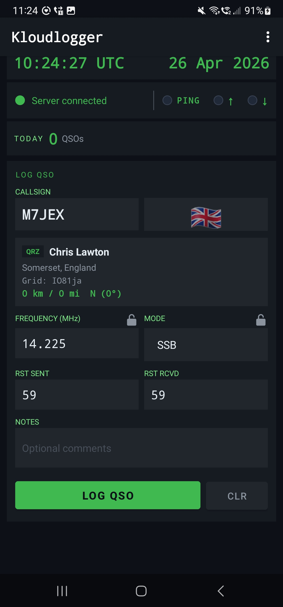
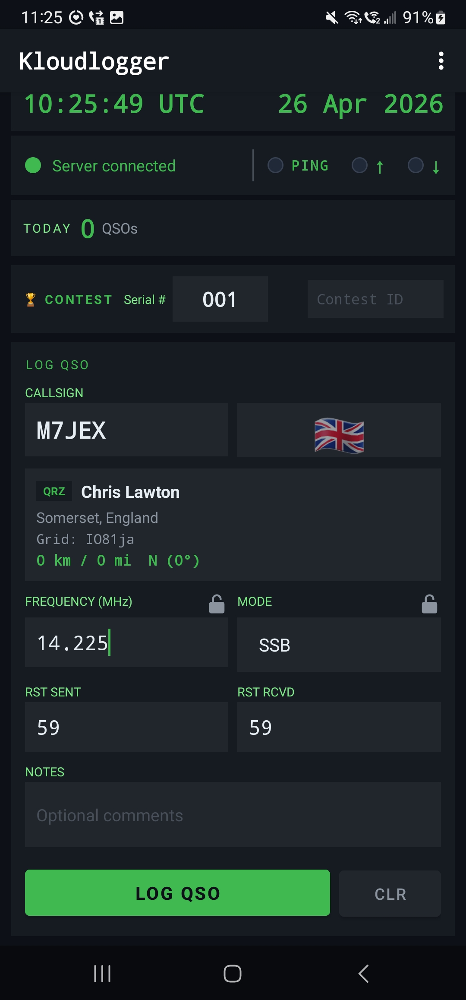
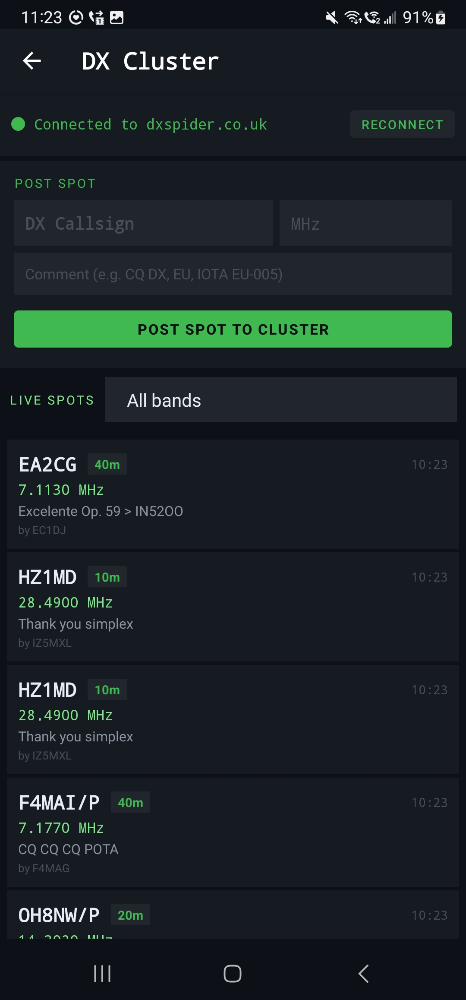
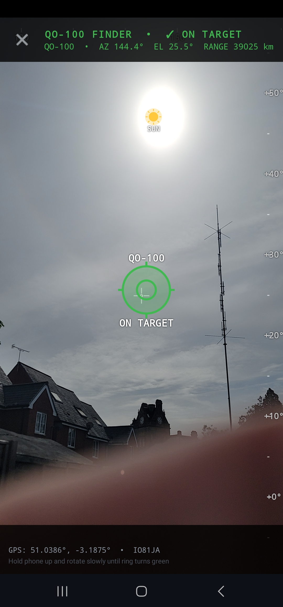
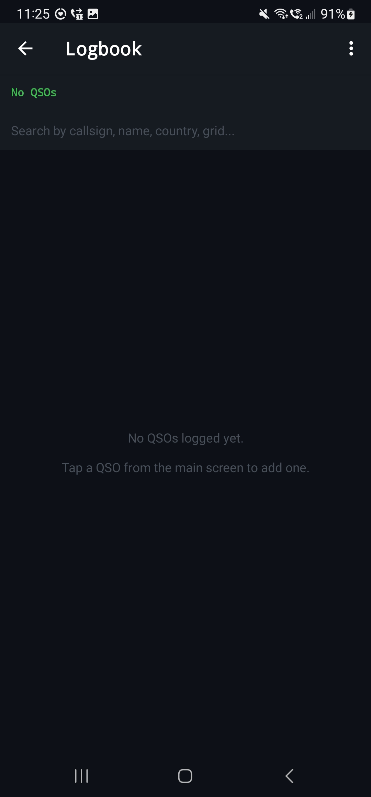
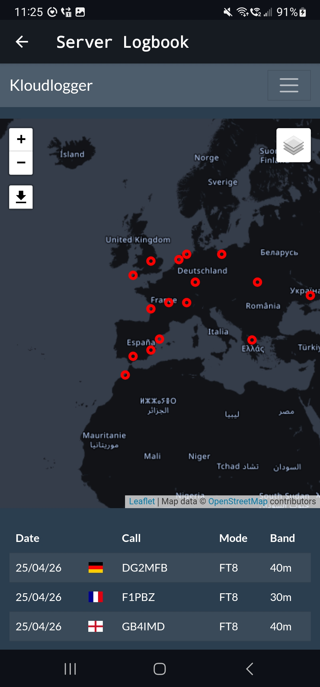
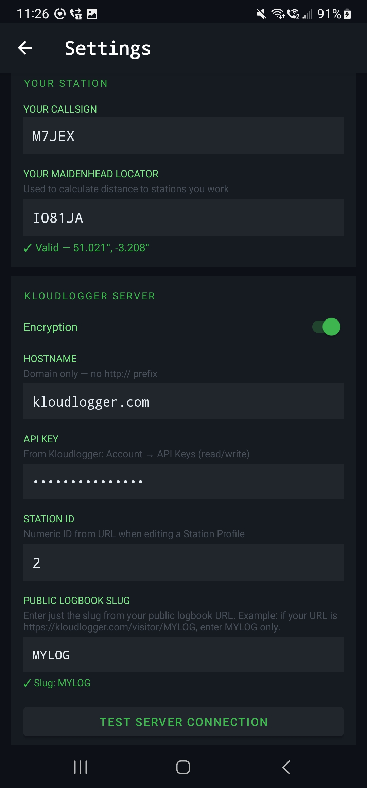
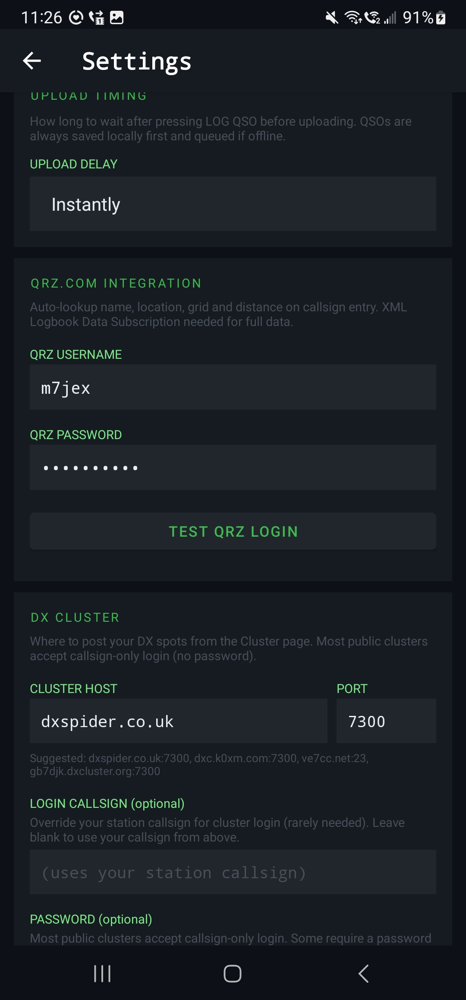

# Kloudlogger-for-Android
Android Kloudlogger client app to connect to my kloudlogger online logbook. Works with both smartphones and tablets. It will also work with Cloudlog!

# Kloudlogger Android App

A full-featured amateur radio QSO logging client for Cloudlog/Kloudlogger servers, with integrated DX cluster connectivity, QO-100 satellite finder, and real-time server synchronisation.

**Current Version:** 1.7.3 (versionCode 16)

## Features

### QSO Logging
- **Fast entry** — Callsign, frequency, mode, RST sent/received, and optional notes
- **Live sync** — QSOs upload to your Cloudlog/Kloudlogger server automatically
- **Contest mode** — Toggle to track serial numbers per contest
- **QRZ lookup** — Fetch caller info from QRZ.com (API credentials required)
- **Frequency locking** — Lock to a repeater frequency, mode, or both

### Server Integration
- **Real-time sync** — Upload QSOs as you log them (configurable delay)
- **Server status** — Connection indicator with activity LEDs for ping, uplink, and downlink
- **Public logbook** — View your shared logbook via your Kloudlogger public slug
- **Status monitoring** — See sync status and server connectivity at a glance

### DX Cluster
- **Live spot stream** — Persistent telnet connection to public DX clusters (DX Spider, AR-Cluster, etc.)
- **Real spot confirmation** — Only reports success when the cluster echoes your posted spot back
- **Band filtering** — Filter spots by any amateur radio band from 2200m through 1mm wavelength
- **Spot posting** — Post DX spots directly to the cluster with your callsign
- **Optional login** — Supports password-protected clusters; callsign-only login for open clusters

### QO-100 Geostationary Satellite Finder
- **AR camera mode** — Live camera feed with augmented reality overlay
- **Precise look angles** — Real-time azimuth and elevation to QO-100 (25.9°E)
- **Sensor fusion** — Accelerometer + magnetometer with aggressive low-pass filtering for smooth tracking
- **Compass tape** — Bearing scale across top of screen; elevation tape on right edge
- **Sun/Moon overlay** — Displays the Sun (yellow with rays) and Moon (grey with crescent) at their current positions
- **Off-screen indicator** — Arrow shows direction when satellite is below horizon
- **Multi-orientation** — Works in portrait and landscape; auto-corrects for device rotation

### Logbook
- **Session view** — Browse all logged QSOs in the current session
- **QSO detail** — View and edit individual log entries
- **Daily stats** — Live count of QSOs today + average rate per hour

## Screenshots

| Screen | Description |
|--------|-------------|
|  | UTC clock, server status with activity LEDs, today's QSO count and rate, QSO entry form |
|  | Contest mode enabled, serial number tracking, same fast QSO entry |
|  | Live DX spot stream, post-a-spot card, band filter dropdown, real-time cluster connection status |
|  | Augmented reality satellite finder with compass tape, elevation tape, Sun/Moon overlay, look angles |
|  | Scrollable list of QSOs logged in this session |
|  | WebView showing your public Kloudlogger logbook |
|  | Cloudlog/Kloudlogger server URL, API key, station ID, public logbook slug, sync timing |
|  | DX cluster host/port/login, QRZ credentials, your callsign, Maidenhead grid, frequency/mode locks |

## Requirements

- **Android:** API level 24 (Android 7.0) or higher
- **Permissions:** Internet, GPS (for satellite finder), Camera (for QO-100 AR mode)
- **Server:** Cloudlog or Kloudlogger instance (self-hosted or cloud)
- **Optional:** QRZ.com account for caller lookup

## Installation

1. Download the latest APK from [GitHub Releases](https://github.com/ChrisL79/KloudloggerApp/releases)
2. Enable "Install from unknown sources" in Android Settings (if needed)
3. Open the APK to install

Or build from source:
```bash
git clone https://github.com/ChrisL79/KloudloggerApp.git
cd KloudloggerApp
./gradlew assembleRelease
# Output: app/build/outputs/apk/release/app-release.apk
```

## Configuration

### Server Setup (Cloudlog/Kloudlogger)

1. Open **Settings** → **Server**
2. Enter your **Hostname** (e.g., `kloudlogger.com` or `mycloud.example.com`)
3. Paste your **API Key** (from your server's user profile)
4. Enter your **Station ID** (numeric, from your server setup)
5. Enter your **Public Logbook Slug** (just the slug; if your public URL is `https://kloudlogger.com/visitor/MYLOG`, enter `MYLOG`)
6. Choose HTTP or HTTPS
7. Tap **TEST SERVER CONNECTION** to verify

### QRZ Setup (Optional)

1. Open **Settings** → **QRZ**
2. Enter your **QRZ.com username** and **password**
3. Tap **TEST QRZ CREDENTIALS**

### DX Cluster Setup

1. Open **Settings** → **DX Cluster**
2. Enter **Host** (default: `dxspider.co.uk`)
3. Enter **Port** (default: `7300`)
4. Enter **Cluster Login** (optional; uses your callsign if empty)
5. Enter **Password** (optional; only needed if your cluster requires it)
6. Tap **TEST CLUSTER CONNECTION** to verify

Popular open clusters:
- `dxspider.co.uk:7300` (DX Spider, callsign-only)
- `dxc.k0xm.com:7300` (DX Spider)
- `ve7cc.net:23` (VE7CC Cluster)
- `gb7djk.dxcluster.org:7300` (DX Spider)

### Your Callsign & Location

1. Open **Settings** → **Station**
2. Enter your **Callsign** (used for QRZ lookup, cluster login, and satellite finder location fallback)
3. Enter your **Maidenhead Grid** (e.g., `IO91VH`; used if GPS is unavailable or disabled)

## Usage

### Logging a QSO

1. On the main screen, fill in:
   - **Callsign** (required) — DX station you contacted
   - **Frequency (MHz)** (required) — Operating frequency
   - **Mode** (optional) — SSB, CW, FT8, etc. (locked or unlocked)
   - **RST Sent / Received** (optional) — Reception reports
   - **Notes** (optional) — Any comments
2. Tap **LOG QSO** — the entry is saved locally and queued for upload
3. Tap **CLR** to clear the form

### Syncing to Server

- QSOs upload automatically on a schedule (default: every 30 seconds after a new entry)
- Watch the **↑ UP** LED on the server status bar — it flashes when data is being sent
- Watch the **↓ DOWN** LED — it flashes when the server responds
- If sync fails, check **Settings** → **Server** and tap **TEST SERVER CONNECTION**

### Monitoring Activity

The **server status strip** shows:
- **● (dot)** — Connection state (green = connected, red = disconnected)
- **Server status text** — Current state and last message
- **| (divider)** — Separator between status and activity
- **● PING** — Flashes every 60 seconds when the server is pinged
- **● ↑** — Flashes when the app sends data (QSO, cluster command)
- **● ↓** — Flashes when the server/cluster responds

### Using the DX Cluster

1. Tap **DX Cluster** from the menu
2. Wait for the cluster to connect (watch the green dot)
3. Spots from other operators appear live as they are posted
4. Filter by band using the **All bands** dropdown
5. To post your own spot:
   - Enter the **DX Callsign** (the station you're spotting)
   - Enter the **MHz** frequency
   - Enter a **Comment** (optional, e.g., "CQ DX", "EU", "IOTA EU-005")
   - Tap **POST SPOT TO CLUSTER**
   - Watch for "✓ Spot for..." confirmation on success

### QO-100 Satellite Finder

1. Tap **QO-100 Finder** from the menu
2. Allow **Camera** and **Location** permissions
3. Point your phone at the sky:
   - **Green ring** = satellite is on-screen and on-target (within 5° of center)
   - **Red ring** = satellite is on-screen but off-target
   - **Arrow off-screen** = satellite is below the horizon or out of frame
4. **Compass tape** (top) — magnetic bearing; cross-hairs = center of view
5. **Elevation tape** (right) — altitude angle above horizon; +5° to +45°+
6. **Sun & Moon** — shown as coloured overlays at their current positions
7. **Look angles** (top of screen) — precise AZ/EL, range, and visibility status
8. Rotate your phone to portrait or landscape — the overlay auto-corrects

### Viewing Your Logbook

1. Tap **⋮ (menu)** → **Server Logbook** to view your shared public logbook (requires public slug in Settings)
2. Tap **⋮ (menu)** → **Logbook** to browse all QSOs logged in this session

## Troubleshooting

### Server Connection Won't Connect

- **Check hostname:** Ensure it's reachable and doesn't include `http://` or `https://`
- **Check API key:** Copy it directly from your server's user profile, without extra spaces
- **Test separately:** Tap **Settings** → **TEST SERVER CONNECTION** to debug
- **Firewall:** If self-hosted, ensure the port (usually 80 or 443) is open

### DX Cluster Spots Aren't Appearing

- **Check cluster:** Tap **Settings** → **DX Cluster** → **TEST CLUSTER CONNECTION**
- **Common issue:** Some clusters require a **password** — check with the cluster sysop
- **Reconnect:** On the DX Cluster page, tap **RECONNECT**
- **Wrong cluster:** Try `dxspider.co.uk:7300` if yours is flaky

### QO-100 Finder Showing Wrong Angle

- **Calibrate compass:** Wave your phone in a figure-8 motion in the air (Android sensor calibration)
- **Magnetic interference:** Move away from metal objects (building, car, equipment)
- **Fallback location:** If GPS doesn't have a lock, the app uses the Maidenhead grid from Settings

### QSOs Not Uploading

- **Check server:** Tap **Settings** → **TEST SERVER CONNECTION**
- **Check sync status:** The server status text on the main screen shows the last sync result
- **Network:** Ensure you have internet connectivity (Wi-Fi or mobile data)
- **Local queue:** Tap the **Logbook** menu to see QSOs — they're stored locally even if sync fails

## Building from Source

### Prerequisites
- Android Studio 2022.1 or later
- Android SDK API level 34
- Gradle 8.2
- OpenJDK 11+

### Build Steps

```bash
git clone https://github.com/ChrisL79/KloudloggerApp.git
cd KloudloggerApp

# Debug APK (for testing)
./gradlew assembleDebug

# Release APK (for distribution)
./gradlew assembleRelease
```

Outputs:
- Debug: `app/build/outputs/apk/debug/app-debug.apk`
- Release: `app/build/outputs/apk/release/app-release.apk`

## Technical Details

### Architecture
- **Language:** Kotlin
- **UI Framework:** Android AppCompat + Material Design
- **Database:** SQLite (local QSO storage)
- **Networking:** OkHttp3 (Cloudlog API), raw sockets (telnet for DX cluster)
- **Sensors:** Accelerometer + Magnetometer fusion (device orientation)
- **Camera:** Camera1 API (QO-100 finder AR overlay)

### Key Algorithms
- **DX Cluster:** Persistent telnet connection with intelligent login/auth handling; regex parsing of DX Spider spot format
- **Sensor Fusion:** Low-pass filtered accelerometer + magnetometer; aggressive smoothing (alpha=0.04) for stable tracking
- **Satellite Math:** Precise look-angle calculation for QO-100 at 25.9°E; 3D projection onto camera sensor plane
- **Astronomy:** Simplified Meeus algorithms for Sun and Moon positions (±0.5° accuracy)

### Permissions

| Permission | Purpose |
|-----------|---------|
| `INTERNET` | Server sync, QRZ lookup, DX cluster telnet |
| `ACCESS_FINE_LOCATION` | GPS for QO-100 finder look angles |
| `ACCESS_COARSE_LOCATION` | Network-based location fallback |
| `CAMERA` | QO-100 AR overlay display |
| `ACCESS_NETWORK_STATE` | Monitor internet connectivity |

## Contributing

Bug reports and feature requests: [GitHub Issues](https://github.com/ChrisL79/KloudloggerApp/issues)

Pull requests welcome. Please:
1. Fork the repository
2. Create a feature branch (`git checkout -b feature/your-feature`)
3. Commit your changes
4. Push to the branch
5. Open a pull request

## Author

**Chris M7JEX** (Somerset, UK)

- QRZBook: [qrzbook.net](https://qrzbook.net)
- Kloudlogger: [kloudlogger.com](https://kloudlogger.com)

## License

GPL-3.0

## Changelog

### v1.7.3 (2026-04-26)
- **Fixed:** Server Logbook URL pattern now uses `/visitor/<slug>` (Kloudlogger standard) instead of deprecated `/index.php/logbookpublic/`
- **Fixed:** Activity LEDs (Ping/Up/Down) now have equal spacing; vertical divider between server status and LED cluster
- **Added:** All amateur radio bands from 2200m to 1mm wavelength in DX cluster band filter
- **Improved:** Settings instructions for public logbook slug are now clearer and more specific
- **Improved:** LED symbols (↑ and ↓) replace word labels for compact visual design

### v1.7.2 (2026-04-26)
- **Added:** 13cm band (2.3 GHz) and other microwave bands (9cm, 6cm, 3cm, 1.25cm, 6mm, 4mm, 2.5mm, 2mm, 1mm)
- **Fixed:** LED layout — UP and DOWN replaced with arrow symbols (↑ ↓) for equal width

### v1.7.1 (2026-04-26)
- **Fixed:** Server Logbook menu now correctly reads `hostname` + `use_https` prefs (was looking for non-existent `base_url` key)
- **Changed:** Error message "Cloudlog" → "Kloudlogger"
- **Improved:** LED strip now uses full screen width with prominent 14dp indicators

### v1.7 (2026-04-26)
- **Added:** Persistent DX cluster client with real-time spot stream, cluster username/password support, honest success/failure reporting
- **Added:** QO-100 satellite finder with compass + elevation tapes, Sun/Moon overlay, aggressive jitter dampening
- **Added:** Server Logbook menu entry (WebView)
- **Added:** Activity LEDs on server status bar (Ping, Uplink, Downlink)
- **Added:** Average QSO rate per hour display next to daily count
- **Added:** Date now matches time styling (22sp green bold monospace)
- **Fixed:** Tablet fullscreen — removed `maxWidth` restrictions
- **Improved:** Settings cluster test button with real connection diagnostics
- **Improved:** DX cluster regex tested against real DX Spider output samples

### v1.6.5 and earlier
See [GitHub releases](https://github.com/ChrisL79/KloudloggerApp/releases) for earlier versions

## FAQ

**Q: Can I use this with Cloudlog?**  
A: Yes. Kloudlogger is Cloudlog-compatible; the app works with both.

**Q: Does the app work offline?**  
A: Partial. You can log QSOs offline — they're stored locally. Once you have internet, they'll sync to the server. DX cluster and QRZ lookup require internet.

**Q: Can I edit a QSO after logging?**  
A: Yes. Open the **Logbook**, tap a QSO, and tap the edit pencil icon.

**Q: How often does the app sync to the server?**  
A: Default is 30 seconds after a new QSO. You can change this in **Settings** → **Server** → **Auto-sync delay**.

**Q: The DX cluster keeps disconnecting.**  
A: Some clusters have time-outs or require periodic keep-alives. Try a different cluster from the suggestions in the settings, or check with your cluster sysop.

**Q: QO-100 finder shows wrong angles.**  
A: Calibrate your phone's compass (figure-8 wave motion). Magnetic interference from nearby metal will throw it off. Make sure you've entered your location correctly in Settings.

**Q: Can I post to multiple clusters?**  
A: Not simultaneously. The app connects to one cluster at a time, but you can manually switch clusters in Settings and reconnect.

---

**Report issues:** [GitHub Issues](https://github.com/ChrisL79/KloudloggerApp/issues)
